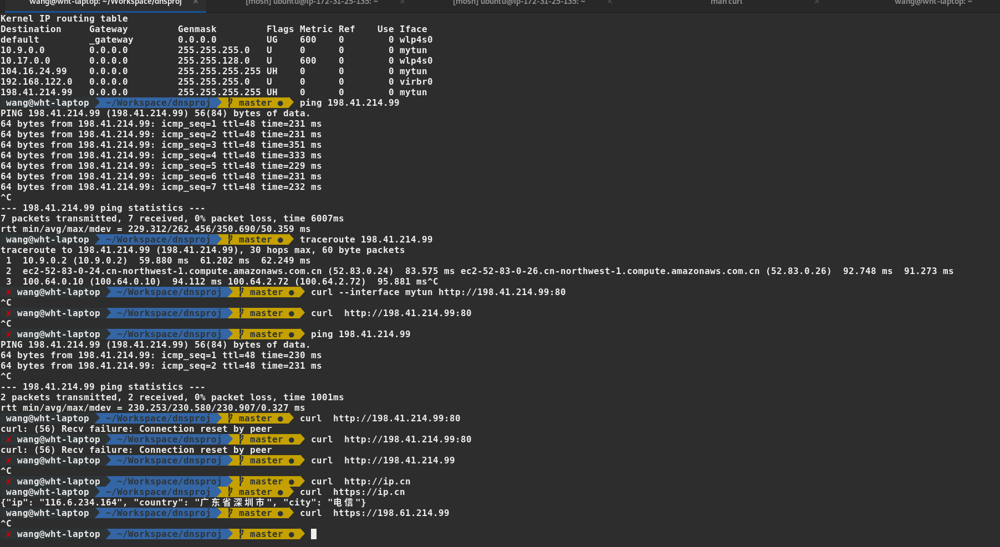
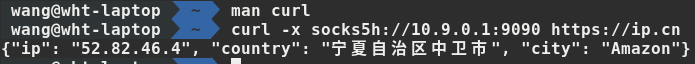

# CS305IP-Over-DNS
This project is a trail just use DNS packet transmitting data between client and server.
## Main Principle
It use the authority DNS name server, local DNS will forward the query to corrosponding name server with subdomain. So client can encode data into QNAME to send data percisely. And the local DNS will recurisively query the authority DNS, so the data can be encoded in TXT fields in RR as well.
## Usage
Running script on client and server. The choice of proxy or NAT is yours.
## Features
-  use timer to control whether send packet to the server, improve efficient
-  base64 encode provide a bad security, however, a ssh tunnel can solve it.

## Testing

